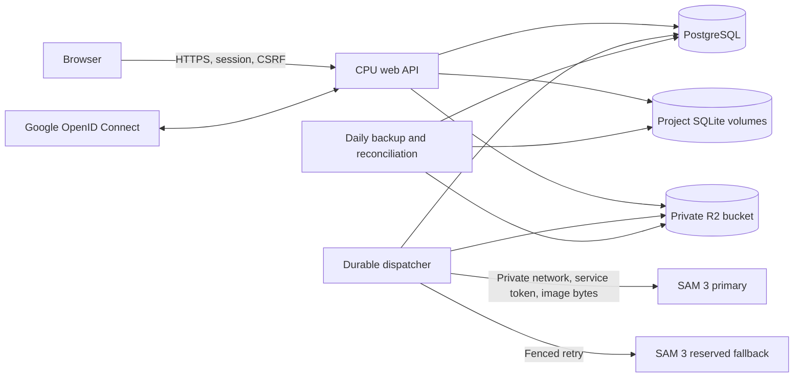

# Hosted Annotation

The hosted service is an independent application (`app.hosted.main`) that reuses
the local editor, geometry, revision handling, and per-project SQLite format.
Start the original local app with `python run.py`; it needs no cloud accounts.
Do not expose that local server to the Internet.

## Components and trust boundaries



Every project has a UUID and an owner. The public API accepts IDs, browser uploads,
and relative COCO filenames; it does not offer server filesystem browsing or
arbitrary remote URLs. Original R2 keys contain UUIDs. Image identity for GPU
embedding caches is project UUID, image ID, and SHA-256.

The browser receives neither R2 credentials nor worker credentials. Downloads
pass through ownership checks and return `Cache-Control: private, no-store`.
Workers receive validated image bytes and prompts, returning masks as RLE.
They do not receive R2 or PostgreSQL access.

## Private configuration

Copy the examples in `deploy/` to a directory **outside the checkout**, with
directory permissions `0700` and file permissions `0600`. Use distinct files,
Google projects, OAuth clients, database credentials, and R2 keys for development
and production. Never add real hosts, addresses, GPU UUIDs, account IDs, tokens,
OAuth JSON downloads, model credentials, or operational inventory to Git.
The Docker build excludes private configuration, caches, datasets, and weights.

Required application values are shown in `deploy/hosted.env.example`.
`ANNOTATION_ENVIRONMENT` must be `dev` or `prod`, with exactly `annotation-dev`
or `annotation-prod` as its bucket. HTTP is accepted only for explicit `dev`
configuration whose public hostname is `localhost`. Other origins require HTTPS.
PostgreSQL is required for hosted deployment; SQLite metadata and filesystem
objects are injectable only in automated tests.

Create each R2 bucket with Standard storage and automatic location. Keep public
access, `r2.dev`, and public custom domains disabled. Create separate Object Read
& Write credentials scoped to just the corresponding bucket. Bucket CORS is not
required because browsers use authenticated application endpoints.

Configure Google OAuth as a Web application with External audience and only
`openid email profile`. The backend implements authorization code flow with
PKCE, one-use state, nonce, signature/issuer/audience/expiration validation, and
its own HttpOnly session cookie. JavaScript origins are unnecessary for this flow.

Development callbacks:

```text
http://localhost:8765/api/v1/auth/google/callback
http://localhost:5173/api/v1/auth/google/callback
```

Set `ANNOTATION_PUBLIC_URL` to the origin actually being used. For Vite, set it to
`http://localhost:5173` and keep its `/api` proxy directed at the backend on 8765.
The testing Google project must list the developer as a test user. Production
uses its own HTTPS callback, authorized domain, and publicly accessible `/privacy`
and `/terms` pages. Complete any Google publication or verification requirements
before opening registration.

## Run the CPU service

Use Python 3.12 and Node 22+:

```sh
python3.12 -m venv .venv-hosted
.venv-hosted/bin/python -m pip install -r requirements-hosted.txt
npm --prefix frontend ci
npm --prefix frontend run build
# Load your private environment through your service manager or shell.
.venv-hosted/bin/python run_hosted.py
```

For containers, configure the paths without putting credentials in the command:

```sh
export ANNOTATION_PRIVATE_ENV_FILE=/path/outside/checkout/application.env
export ANNOTATION_POSTGRES_ENV_FILE=/path/outside/checkout/postgres.env
docker compose -f deploy/compose.yaml build
docker compose -f deploy/compose.yaml up -d
```

The Compose stack has separate web, PostgreSQL, dispatcher, and maintenance
services. The web port binds to host loopback. PostgreSQL has no host port.
Project SQLite databases and PostgreSQL use persistent volumes. The image cache
is disposable and bounded at 5 GB. Never mount R2 as an SQLite filesystem.

Adapt the generic Nginx example in private configuration, including the correct
origin certificate. Verify the backend over loopback and HTTPS before adding
public DNS. Use Cloudflare's strict origin TLS validation. Do not overwrite
existing server blocks or unrelated DNS records.

## GPU workers

Install the appropriate vendor CUDA-enabled PyTorch and torchvision build for
each architecture first. Then install `requirements-worker.txt`. This file
intentionally does not install PyTorch: an ARM64 CUDA installation must not be
replaced by an incompatible CPU wheel. Pin the verified runtime or image digest
in private operations configuration. Workers require the pinned SAM 3 and
Spanish-to-English weights described by the existing inference modules.

Configure `deploy/worker.env.example`, a unique random service token, persistent
attempt-ledger directory, and a private network bind address. Expose the service
only to the CPU server with a Tailscale policy or host firewall. The application
token is an additional restriction, not a replacement for network isolation.

Set `ANNOTATION_WORKER_BIND` to the private Tailscale address and
`ANNOTATION_WORKER_ALLOWED_CLIENTS` to the CPU server's exact source IP.
The included launcher disables forwarded-header trust and binds only Tailscale
and loopback sockets. The container uses host networking to preserve source IPs.

```sh
python -m app.hosted.worker
```

The worker preloads models and performs real warmup before reporting ready.
Its supervisor enforces a 120-second execution deadline by terminating the
inference process. Attempts have immutable IDs and persistent replay records.
The dispatcher polls every five seconds, permits one global active job, and
chooses users by least recently served time. A lost response is polled under
the same attempt ID. A single infrastructure retry can use the other worker
after confirmed termination or the execution deadline plus five seconds.
Late/duplicate attempt results cannot complete a replacement attempt.

Keep fallback URL and token empty until the separately configured fallback host
has passed its runtime tests. Assign only the intended GPU to each worker.
The worker Dockerfile and Compose template are in `deploy/README.md`; hardware
inventory and any allocation decisions belong in private operations records.

## Limits and data lifecycle

- 1 GB of active data per user; 50 GB globally. This includes original image
  bytes, thumbnails, and canonical persisted project data (annotations, drafts,
  proposals, categories, and COCO metadata). Physical SQLite indexes and free
  pages, transient jobs/exports/cache, and retained backups are excluded.
- At most 20 MiB and 16 megapixels per still image.
- 300 successful requests or cancellations after execution starts per user per
  UTC day. Queued cancellations and failed requests release the reservation.
- Two pending jobs per user, 64 pending globally, one executing globally.
- Storage is reserved before multipart parsing, then reconciled against validated
  image bytes, thumbnails, and project metadata. Metadata edits prepare an
  immutable SQLite generation and reserve its exact increase in PostgreSQL
  before replacing the live file. A persistent journal settles interrupted
  commits before the next project read, write, or backup.
- Originals stay while active. Generated exports and temporary objects expire
  after 24 hours. Deleting a project revokes application access immediately.
- Daily coordinated backups retain seven days; referenced deleted originals
  remain until the last retained manifest no longer requires them.

These application quotas are not an R2 billing ceiling. Database backups,
retained deleted objects, and storage operations also consume resources.
The hosted service checks free local disk before accepting uploads or edits.
Queued jobs expire after 24 hours and release their quota reservation. Terminal
job results and worker result payloads expire after 24 hours; worker attempt
identities remain to prevent duplicate execution. Reconciliation removes expired
authentication flows, sessions, and unreferenced staging files.

## Backups and restoration

The maintenance service runs reconciliation and daily backups. It completes
pending project journals before taking a snapshot. A backup locks
metadata and project writes, snapshots live SQLite databases with SQLite's backup
API, exports a PostgreSQL snapshot for `pg_dump`, and writes checksummed artifacts
to R2. `manifest.json` is the last object written and the completion marker.
Original objects are immutable references rather than a new daily 50 GB copy.
PostgreSQL 15 client utilities are included in the CPU image.
Writes wait while a backup holds these locks, including its artifact uploads;
the duration grows with the dataset. Deleted project databases and metadata
are removed after the last referencing backup expires and no remaining job or
journal needs them.

Manual commands use the same private application environment:

```sh
python -m app.hosted.maintenance backup
python -m app.hosted.maintenance reconcile
python -m app.hosted.maintenance restore \
  --manifest backups/BACKUP_UUID/manifest.json \
  --database-url-env ANNOTATION_RESTORE_DATABASE_URL \
  --data-dir /path/to/empty/restore-volume
```

Stop all processes that could use the destination. Restore requires an empty
database and empty directory, and verifies checksums of databases and referenced
images before mutation. The source bucket must still contain those originals.
Restore does not recreate missing originals from the manifest alone. Existing
sessions are invalidated and in-flight jobs are failed without consuming quota.
Test full restoration regularly in an isolated destination before changing
production volumes.

## Validation and release

```sh
.venv/bin/python -m pytest -q
npm --prefix frontend test -- --run
npm --prefix frontend run build
git diff --check
```

Automated tests inject private local object storage and mock Google/worker
transports; passing them alone does not certify a public deployment. Before
launch, also exercise real PostgreSQL concurrency, scoped R2 keys and cross-bucket
denial, actual Google consent and logout, both physical GPU runtimes, failover,
backup/restore, and browser upload → annotate → save → reopen → COCO export.
Verify unrelated workloads after GPU reassignment and inspect the commit and
Docker build context for secrets. Publish the branch separately from `main`;
add public DNS only after the live checks pass.
