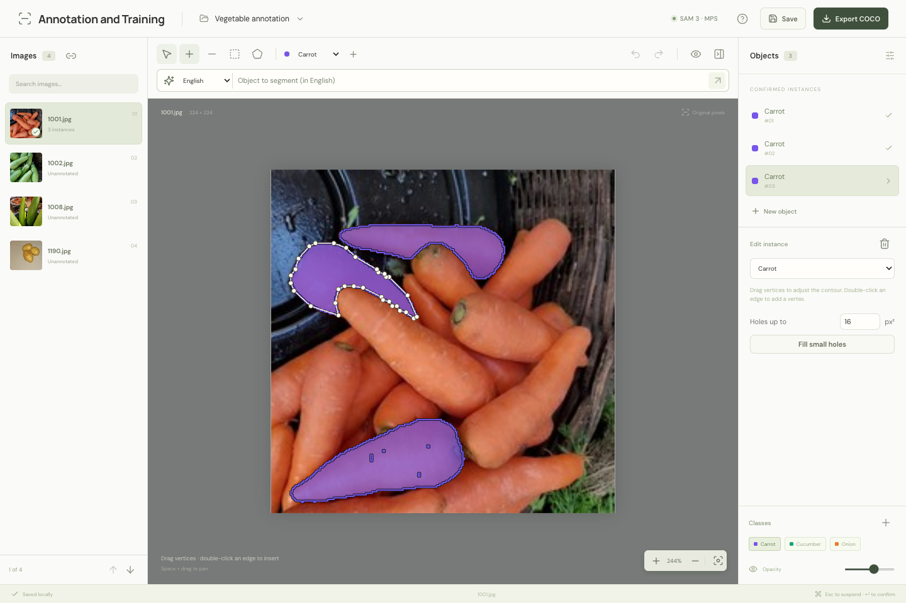
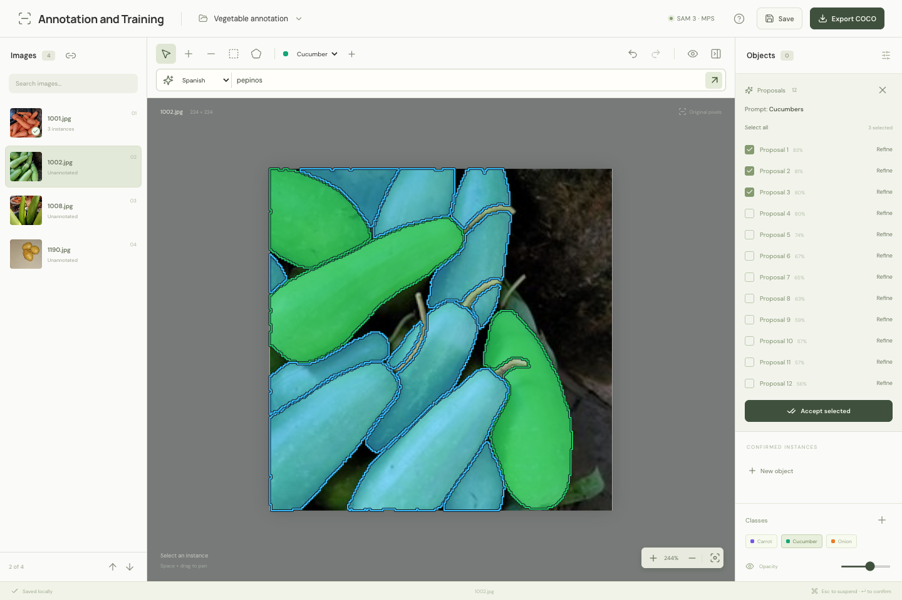
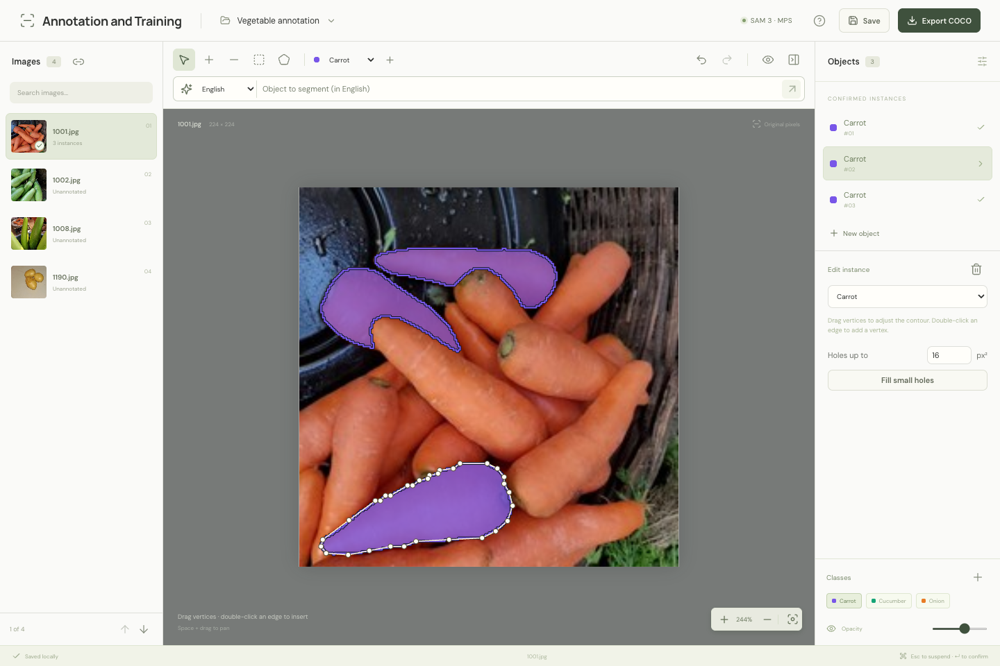

# Annotation and Training

A local web application for image instance segmentation with **SAM 3**. Annotate with text, positive/negative clicks, boxes, or an approximate polygon; refine masks, edit vertices, and import/export COCO. The interface is in English. Images, prompts, and annotations are processed locally.

Built with React, TypeScript, React Konva, FastAPI, PyTorch, and SQLite.

## Screenshots

The editor keeps image navigation, annotation tools, and instance controls around the canvas. Masks remain editable after SAM confirmation.



Text prompts run from the toolbar. Spanish concepts can be translated locally to English before SAM generates selectable proposals.



Small mask holes can be filled explicitly with an adjustable pixel-area threshold. Cleanup supports undo/redo and preserves the outer mask boundary.



## Install

Requires **Python 3.12**, **Node.js 22.x (22.13 or later), 24.x, or 26+**, and npm. Target platforms are macOS Apple Silicon, Linux, and Windows through WSL. SAM 3 has been validated on an M4 Max using MPS and CPU; Linux/CUDA and WSL still require testing on those systems. See [VALIDATION.md](VALIDATION.md) for measured results and limitations.

```sh
python3.12 scripts/setup.py
```

Setup creates `.venv`, installs the pinned Python dependencies, and builds the frontend. It does not install Python or modify its global environment. Run setup again after pulling dependency updates.

Manual installation:

```sh
python3.12 -m venv .venv
.venv/bin/python -m pip install -r requirements.txt
cd frontend
npm ci
npm run build
cd ..
```

For a CUDA installation on Linux/WSL, follow the [official PyTorch installation instructions](https://pytorch.org/get-started/locally/) for your GPU, retaining the versions in `requirements.txt`. Apple GPU acceleration runs directly on macOS through MPS; Docker is not required.

## SAM 3 access

1. Request access and accept the terms for the official [facebook/sam3 weights](https://huggingface.co/facebook/sam3).
2. Sign in locally with `.venv/bin/hf auth login`. Keep tokens out of project files.
3. Click **SAM 3** in the application or start a segmentation. The initial download requires an internet connection and several GB of free space. Weights are cached in `.cache/huggingface` for subsequent offline use.

Text proposals use `Sam3Model`; points, boxes, and mask refinement use `Sam3TrackerModel`. A 403 or gated-repository error means the authenticated account/token does not have access to the weights. Model errors are reported directly; missing weights do not produce simulated annotations.

## Run

```sh
python3 run.py
# Optional device selection:
python3 run.py --device mps
python3 run.py --device cpu --no-browser
```

Open [http://127.0.0.1:8765](http://127.0.0.1:8765). The server listens only on localhost. Press `Ctrl+C` to stop it. Initial model loading can take longer than subsequent requests.

## Projects and image folders

Select the **project directory** and **image directory** separately. A new project requires an explicit image-folder selection; the picker starts at the selected project directory. It does not assume or create an `imágenes/` subfolder. Choose the whole image folder, include subfolders, or select individual files.

For example, explicitly select `project/images/` as the image directory:

```text
project/
├── proyecto.sqlite3
├── anotaciones.coco.json   # Created by Export COCO
└── images/
    ├── photo-001.jpg
    └── batch-2/photo-002.jpg
```

Images may also live outside the project. Existing files are used directly, without copying. Annotations are stored outside the image directory. Each image is identified by its path relative to the image root, such as `batch-2/photo-002.jpg`; COCO uses the same `file_name` without an `images/` prefix.

Moving a project together with an internal image folder preserves relative paths. If only the image folder moves, use **Relink image directory** and choose its new root. Relinking checks files and dimensions, including subfolder paths. Existing projects retain their saved image roots and data: the filenames `proyecto.sqlite3` and `anotaciones.coco.json` remain unchanged for compatibility.

## Annotate

Hover over toolbar tools to see their English labels and keyboard shortcuts. Choose a class, then use **Positive point**, **Negative point**, or **Bounding box**. **Add part to object** adds another region to the same instance; prompts affect the active part. Press **Enter** to confirm the union of its masks.

For an irregular region:

1. Select **Polygon** (`G`) and click to add vertices.
2. Close it by clicking the first vertex, pressing Enter, or choosing **Close polygon**.
3. Click **Refine with SAM**. The polygon becomes an initial mask prompt; it does not strictly constrain the predicted boundary.
4. Add positive or negative clicks to correct the result.
5. Press **Enter** to confirm. Drag the resulting vertices, double-click an edge to insert a vertex, or select a vertex and delete it.

Unfinished polygons and other drafts are autosaved. The initial polygon remains available for editing during refinement, until the object is confirmed. The exact predicted mask is retained until a manual geometry edit or an explicit cleanup.

Masks have visible class-colored boundaries, including holes and separate components. Adjust **Mask opacity** or toggle mask visibility with `H`. Navigating between images preserves annotations and drafts. **Save** flushes pending project changes; **Export COCO** creates a separate JSON file.

Internal editing handles can belong to holes in the predicted mask, including single-pixel gaps. To remove small gaps, select an instance, set **Holes up to** in original-image pixels squared (default **16 px²**), and click **Fill small holes**. This fills enclosed background regions at or below that area, preserves larger holes, disconnected foreground parts, and the outer mask boundary, and regenerates editing handles. Background regions use edge adjacency; a diagonal-only contact does not join them. The action is explicit and supports undo/redo; imported and existing annotations are never cleaned automatically.

### Text prompts in English or Spanish

The top toolbar contains the text prompt and a **Prompt language** selector. Choose **English** or **Spanish**, enter a short object description, and press Enter to generate proposals. Select and accept multiple proposals, or refine one with clicks. A text search does not create or rename classes.

Spanish prompts are translated to English locally with the public [Helsinki-NLP/opus-mt-es-en model](https://huggingface.co/Helsinki-NLP/opus-mt-es-en), licensed under [Apache 2.0](https://huggingface.co/Helsinki-NLP/opus-mt-es-en/blob/main/README.md). The first Spanish request downloads approximately **312 MB**; translation then runs on CPU using cached weights, including offline. It is free to run locally and requires no translation API key or per-request payment. This is separate from the gated SAM 3 access above.

The English text sent to SAM is displayed with the results so you can review it. Translation can change the intended meaning: if needed, select English, edit the wording, and run the search again. English prompts bypass translation. Images and prompt text are not sent to a translation service.

### Keyboard shortcuts

| Shortcut | Action |
| --- | --- |
| `N` | New object / resume draft |
| `V` | Select and edit |
| `P` / `E` | Positive / negative point |
| `B` / `G` | Bounding box / polygon |
| `Enter` | Close an open polygon / confirm the current object |
| `Esc` | Suspend draft / deselect |
| `↑` / `↓` | Previous / next image when no object is selected |
| `Cmd/Ctrl+Z` | Undo |
| `Cmd/Ctrl+Shift+Z` or `Ctrl+Y` | Redo |
| `Cmd/Ctrl+S` | Save project |
| `Delete` / `Backspace` | Delete selected vertex or instance |
| `F` / `H` | Fit image / toggle masks |
| `Space+drag` | Pan |
| `?` | Show shortcuts |

Annotation shortcuts do not intercept typing in text fields. Enter in the text prompt runs the search.

## COCO and mask fidelity

Import COCO **instance segmentation** by selecting a JSON file, image root, and new project directory. Polygon segmentations and compressed/uncompressed RLE are supported. Import validates files, dimensions, IDs, and references before saving, and retains a backup of the original JSON. Failed imports do not leave partially saved projects. Project merging and automatic conversion of box-only annotations are not supported.

Export uses compressed RLE to preserve exact masks, holes, and disconnected components. Area and bounding boxes are calculated from the final mask. New objects have `iscrowd=0`; imported values are preserved. Masks can be reconstructed with `pycocotools.COCO.annToMask`. External importers that only accept polygon segmentations may require conversion.

Images use their stored pixel matrix without automatic EXIF rotation, keeping coordinates and dimensions aligned with existing COCO annotations. Source images are not modified.

## Development and checks

```sh
.venv/bin/python -m pip install -r requirements-dev.txt
.venv/bin/python -m pytest -q
node --experimental-strip-types --test tests/frontend-masks.mjs
cd frontend
npm run test
npm run build
```

For development, run `python3 run.py --dev --no-browser` and start `npm run dev` inside `frontend/`; Vite proxies API requests to the local backend.

Real SAM 3 checks require authorized weights and are separate from unit tests. Run `.venv/bin/python scripts/benchmark_sam3.py --help` to benchmark your own images. Mocked responses are not evidence of model quality. See [API_CONTRACT.md](API_CONTRACT.md) for the API and [VALIDATION.md](VALIDATION.md) for validation details.

Dependencies are pinned in `requirements.txt`, `constraints.txt`, and `frontend/package-lock.json`. This repository contains integration code, not model weights. SAM 3 is subject to [Meta's model license](https://github.com/facebookresearch/sam3/blob/main/LICENSE).
